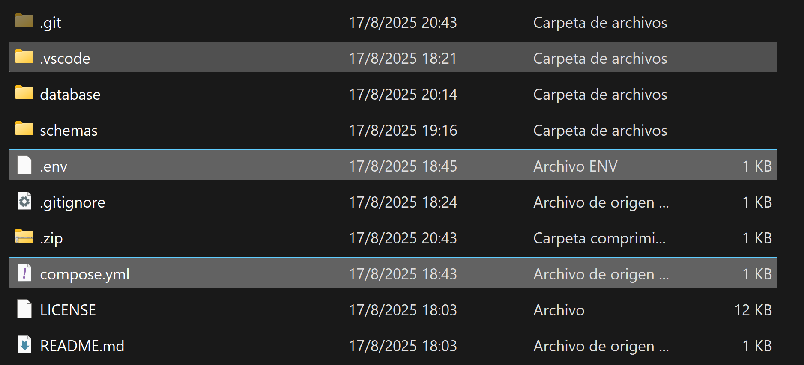

# Documentación de la configuración y la base de datos

<aside>
💡

Este proyecto gestiona los archivos necesarios para hacer funcionar todos los microservicios, incluyendo la base de datos y la configuración inicial (archivos .env, esquemas de base de datos, configuraciones, etc.). Funciona como un punto central que unifica estos componentes.

</aside>

# Paso 1:

- Clonar el proyecto de GitHub con el siguiente encale:

```
git clone https://github.com/brayrpgs/GLOB-DB.git
```

# Paso 2:

- Una vez clonado el repositorio, abrir la carpeta

> GLOB-DB
> 
- y copiar estos 3 archivos de configuración:

> .vscode
.env
compose.yml
> 



Copia estos 3 archivos al directorio superior (carpeta anterior).
El resultado debe quedar similar a la siguiente imagen.


Una vez hecho esto, abre una terminal o CMD desde este punto y ejecuta el siguiente comando para abrir VS Code:

```
code .
```

# Paso 3:

Ejecutaremos la tarea llamada `Docker`

<aside>
💡

Para ejecutar tareas en VS Code, puedes usar el atajo `Shift + Ctrl + B` (en Windows/Linux) o `Shift + Cmd + B` (en Mac).

</aside>

Una vez finalizado, veremos en la terminal inferior el siguiente mensaje (puede variar)


# Paso 4:

Una vez finalizado todo, accederemos a la siguiente ruta en nuestro navegador: `localhost:8080` o `127.1.1.1:8080`

Allí nos recibirá el siguiente login:


Ingresaremos con las credenciales que se encuentran en el archivo de configuraciones `.env`

en él buscaremos las siguientes variables de entorno que contienen las credenciales necesarias para iniciar sesión:

```
PGADMIN_DEFAULT_EMAIL=xxxxxxxxxxxxx
PGADMIN_DEFAULT_PASSWORD=xxxxxxxxxxx
```

# Paso 5:

Finalmente, cargaremos la base de datos para que todo quede funcional y listo para usar.

Ahora registraremos una conexión a un servidor de bases de datos PostgreSQL, ver imagen …


Aparecerá un apartado donde configuraremos la conexión. Aquí le asignaremos un **Nombre** a esta conexión (puede ser cualquiera)


Ahora, seleccionaremos la sección 'Connection' y completaremos los siguientes datos:

> Host name: `GLOB-DB` 
Port: `5432`
Username: `POSTGRES_USER` (definido en `.env`)
Password: `POSTGRES_PASSWORD` (definido en `.env`)
Save password: `check`
> 


y daremos en guardar!

# Paso 6:

Si hasta este punto todo ha ido bien, podremos avanzar al siguiente paso: cargar los esquemas.

Para ello, veremos que se ha creado una base de datos llamada `GLOB_DB` (definido en `.env`)


Para cargar los esquemas, usaremos la opción Restore...


Allí presionaremos sobre el icono de carpeta

en este nuevo apartado, haremos clic en el botón de opciones extendidas (representado con tres puntos)


y presionamos `Upload`


Simplemente arrastraremos el archivo llamado `DATABASE.SQL`  este esta ubicado en la siguiente ruta
 `GLOB-DB\database`


Una vez seleccionado y cargado el archivo, podremos usarlo para cargar nuestros esquemas. Aparecerá en nuestro visualizador de archivos donde lo seleccionamos y presionamos en 'Select':


Finalmente, hacemos clic en 'Restore' y con esto habríamos completado el proceso.


<aside>
💡

Para verificar que todo se ha instalado correctamente, comprueba que las tablas aparezcan correctamente (como se muestra en el ejemplo). Ten en cuenta que en versiones posteriores podrían aparecer más tablas que las mostradas en el ejemplo.

</aside>

